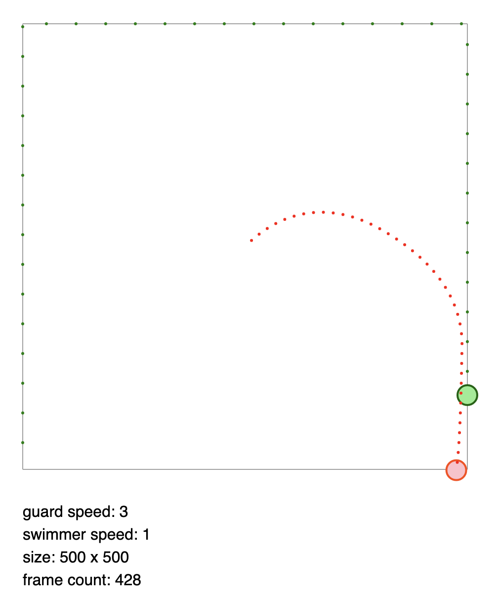

## Swimmer vs guard

Simulation to solve the guard vs swimmer problem.

Basic description: a guard runs in straght lines 3 times faster than a prisoner can swim around a square pool. Can the swimmer escape?

We simulate what would happen if the swimmer always positioned himself in the direction opposite from the guard while moving away from the center of the pool.

  

Written in javascript using two.js
